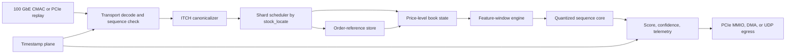

# Architecture

Aegis-Stream is organized as a deterministic streaming pipeline with one
canonical event format between market-data parsing and book/model processing.

## Data Contract

The canonical event is 256 bits:

| Bits | Field | Notes |
|---:|---|---|
| 255:248 | event type | Normalized Aegis event code |
| 247:232 | stock locate | Nasdaq stock-locate field |
| 231:168 | order reference | Existing or old order reference |
| 167:136 | price | ITCH integer price |
| 135:104 | shares | ITCH integer quantity |
| 103:96 | side flags | `1=bid`, `2=ask` |
| 95:32 | timestamp | Nanoseconds since midnight or aligned timestamp |
| 31:0 | misc | Tracking and match-number low bits |

`src/aegis_stream/itch.py` and `hardware/rtl/aegis_stream_pkg.sv` are kept in
lockstep for this format.

## Software Golden Path

The Python implementation is the reference model used to validate future RTL:

1. `itch.parse_messages` decodes concatenated ITCH messages.
2. `OrderBookShard.apply_event` mutates exact order-reference and level state.
3. `FeatureWindowEngine.update` emits a 64-feature int8 vector and rolling
   window.
4. `QuantizedTemporalMixer.predict` returns a deterministic score and action.
5. `TelemetryRecorder` reports stage-wise replay latency summaries.

## Hardware Growth Path

The starter RTL is intentionally limited to aligned messages. The next hardware
steps are:

1. Add packet buffering and byte-lane alignment for variable-length ITCH records.
2. Add transport sequence validation and loss/gap telemetry.
3. Build a banked order-reference store with BRAM/URAM hot cache and HBM model.
4. Add book-state, feature-window, and sequence-core modules behind the same
   ready/valid contracts.
5. Use cocotb to compare every RTL stage against the Python package.
