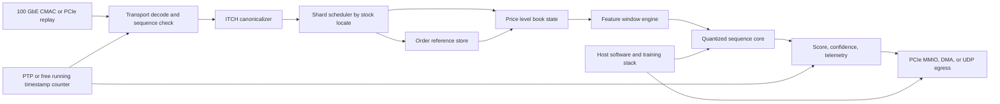
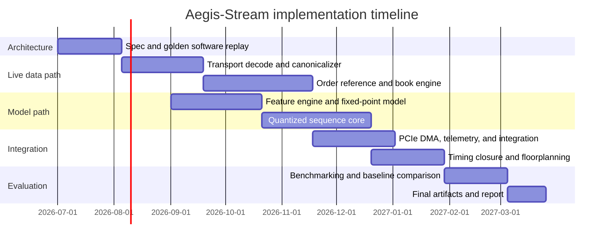

# Aegis-Stream

## Executive summary

**Project title:** **Aegis-Stream: A Deterministic HBM-Resident FPGA for Sub-Microsecond Limit-Order-Book Analytics and Low-Batch Sparse Sequence Inference.** The proposed project is a research-grade FPGA system that starts at live market-data ingress, reconstructs a full depth order book from Nasdaq TotalView-ITCH style messages, computes streaming microstructure features, and performs low-batch quantized sequence inference on the FPGA before returning a score or action hint to host software. It is deliberately chosen to sit at the intersection of two worlds that top hardware teams care about: deterministic feed-handling and latency engineering for quant trading, and bandwidth-aware low-precision sequence acceleration for modern AI systems. Nasdaq’s ITCH specification explicitly includes hardware-FPGA feed variants and message types such as add, execute, cancel, delete, replace, and non-cross trade messages, which makes this a realistic hardware target rather than a toy benchmark. citeturn5view3turn11view0turn11view1turn11view2

The main reason this project is unusually strong as a portfolio centerpiece is that it exercises the exact skills that differentiate strong digital-design candidates from generic “accelerator” resumes: network ingress at line rate, protocol parsing, strict timestamp accounting, banked memory systems, low-latency model serving, careful floorplanning, formal verification of stateful pipelines, and a benchmark methodology that spans both correctness and performance. On the quant side, that maps to exchange-style direct-feed engineering and order-book state maintenance. On the AI-hardware side, it maps to custom precision, memory hierarchy design, dataflow scheduling, sparse or linearized attention, and accelerator/software co-design. Existing literature splits these concerns across separate communities: DeepLOB and later LOB work focus on predictive models, hls4ml and FINN focus on ultra-low-latency or quantized FPGA inference, and FTRANS/FAMOUS focus on transformer attention acceleration; Aegis-Stream intentionally fuses them into one end-to-end system. citeturn21view3turn16view0turn15search0turn15search5turn6view0turn22view0

Because you specified **no specific constraint** for FPGA family, budget, or host fabric, the proposal assumes a **standards-based prototype** with PCIe and Ethernet as concrete interfaces, and treats ASIC-style coherent fabrics as a future mapping path. For a public, reproducible build, the best primary prototype is an AMD Alveo U55C because it exposes 16 GB of HBM2, 460 GB/s HBM bandwidth, dual QSFP28 networking for up to 200 Gbps aggregate board networking, and a 115 W TDP envelope in a widely used data-center card. A strong secondary port is the Altera Agilex 7 M-series HBM2e platform, which offers in-package HBM2e, hardened memory NoCs, PCIe 5.0/CXL capability, and up to 1 TB/s class memory bandwidth. Looking further ahead, current FPGA roadmaps and public standards make PCIe, CXL, and UCIe much more realistic follow-on interfaces for an ASIC transition than any proprietary GPU-only interconnect path. citeturn7view0turn7view1turn7view3turn13view1turn13view0turn8search2turn8search0

The headline technical targets are deliberately ambitious but credible. The trading path targets **one-port 100 GbE lossless ingest**, **sub-250 ns parser plus canonicalization latency**, **sub-400 ns book-state plus feature update latency**, and **sub-800 ns model latency**, yielding a **median tick-to-score target below 1.5 µs** and a **p99 target below 2.0 µs** for a hot-symbol set. The AI path targets a **reconfigurable attention and temporal-mixing engine** that reaches at least **250 GOPS on U55C** and scales upward on Agilex-class HBM devices. The research contribution is not merely “being fast,” but showing that a single banked, formally-verified streaming architecture can satisfy both sub-microsecond event-driven finance constraints and memory-bound sequence-model constraints on the same FPGA substrate. That is exactly the kind of systems argument that will stand out to Jane Street or Optiver interviewers and still read as serious accelerator work to NVIDIA or AMD teams. citeturn22view0turn6view0turn15search5turn16view0

## Motivation and research agenda

The quant relevance is straightforward. Modern electronic markets expose full order-depth feeds, and Nasdaq TotalView-ITCH distributes order-level data with variable-length, sequenced messages that can be delivered over SoupBinTCP or MoldUDP64. A hardware system that ingests those messages, maintains state by order reference, and derives low-latency alpha or execution signals directly from the live book addresses a real class of quant infrastructure problems. In the academic literature, high-frequency LOB forecasting remains challenging because the raw data is noisy, stateful, and highly microstructural; the FI-2010 benchmark was created precisely because large-scale, structured LOB prediction is difficult, and later work argues that conventional ML metrics alone can be misleading unless they are tied to operational objectives. citeturn11view4turn21view0turn20view1

The AI relevance is also direct. Sequence models and attention mechanisms are dominated by memory movement, quantization choices, and schedule quality. FPGA research on transformer acceleration repeatedly emphasizes compression, tiling, and memory-efficiency because large models are bottlenecked by storage and bandwidth rather than by raw multiply count alone. FTRANS reported up to 16× model compression and strong performance and energy-efficiency improvements over CPU and GPU baselines, while more recent FPGA attention work such as FAMOUS showed that careful tiling and BRAM/DSP utilization on Alveo U55C can reach hundreds of GOPS and beat CPU/GPU baselines on specific attention kernels. Meanwhile, production AI hardware platforms such as NVIDIA H100 and AMD MI300X underline the centrality of bandwidth and interconnect: H100 exposes 3 TB/s of memory bandwidth per GPU and MI300X reports 5.325 TB/s peak HBM3 bandwidth. Aegis-Stream is therefore relevant because it attacks the same first-principles bottlenecks—dataflow, memory banking, quantization, and latency predictability—on a reconfigurable platform. citeturn6view1turn6view0turn22view0turn23search2turn23search0

The research questions should be posed explicitly:

**Can a full market-data-to-inference pipeline remain deterministic at sub-microsecond scale?** This is the central quant-systems question. It is only meaningful if correctness of the order-book state is proved against a golden software replay and if latency is reported as a full distribution, not just a single number. Nasdaq’s nanoseconds-since-midnight timestamps and explicit order-reference semantics make this feasible. citeturn11view0turn11view1

**Can a compact quantized sequence model preserve most of the predictive signal of software LOB models while staying inside a fully streaming FPGA datapath?** DeepLOB, later transformer-like LOB models, and HLOB all suggest that deeper spatial and temporal structure in the book matters; the open problem here is whether a carefully compressed, hardware-aware model can keep most of that signal while eliminating off-chip control overheads that destroy latency. citeturn21view3turn20view0turn20view1

**Can one compute substrate serve both finance-style event inference and AI-style sequence kernels?** This is the novelty that makes the project stronger than a standard “feed handler” or standard “attention accelerator.” Instead of building a fixed DeepLOB clone, Aegis-Stream uses a parameterized low-precision tensor fabric that supports temporal convolution, linear or sparse attention, reductions, and gated MLP blocks. That architecture should be judged not only on tick-to-score latency but also on a more traditional accelerator metric such as GOPS on published attention shapes. citeturn22view0turn15search5turn15search0

The novelty claim should therefore be framed carefully. It is **not** that no one has built an FPGA order-book pipeline or no one has accelerated attention before. The novelty is the **co-designed unification** of the following six pieces into a single reproducible system: direct-feed parser, exact book-state maintenance, online feature extraction, a quantized sequence model chosen for hardware locality, a shared compute fabric that is also benchmarkable on attention workloads, and a verification stack that treats both market-state correctness and accelerator correctness as first-class artifacts. That combination is much closer to a publishable systems-and-architecture project than to a class exercise. citeturn11view0turn16view0turn15search5turn22view0

The measurable targets below are the ones I would put into a proposal or paper abstract. They are design targets, not promises, but they are grounded in published device capabilities and recent FPGA datapoints:

| Category | Target for primary U55C build | Stretch target on larger HBM FPGA |
|---|---:|---:|
| Live ingress | Sustained 100 GbE, zero drops in validated regime | Dual-port 200 GbE aggregate |
| Parser plus canonicalization | under 250 ns median | under 200 ns median |
| Book update plus feature update | under 400 ns median | under 300 ns median |
| Model latency | under 800 ns median | under 600 ns median |
| End-to-end tick to score | under 1.5 µs median, under 2.0 µs p99 | under 1.2 µs median |
| AI microbenchmark | over 250 GOPS | over 350 GOPS |
| Incremental board power | under 90 W dynamic, within card envelope | under platform envelope |
| FPGA area target | below 70% LUT, below 55% DSP | below 65% critical resources |
| Accuracy target | at least 95% of float baseline F1 or balanced accuracy on matched split | at least 98% of int8 baseline |
| Prototype cost planning | no hard cap assumed; target build range shown later | same |

These targets are plausible on the proposed hardware because U55C already provides 16 GB HBM2 at 460 GB/s and dual QSFP28 networking, while Agilex 7 M-series explicitly targets high-bandwidth data-center and AI-style workloads with in-package HBM2e, hardened memory NoCs, PCIe 5.0/CXL, and up to 1 TB/s class memory bandwidth. The target also fits the trendline in open FPGA ML work: hls4ml has already shown convolutional inference latencies in the microsecond regime, FINN explicitly targets sub-microsecond dataflow accelerators, and FAMOUS demonstrated attention throughput in the same board class. citeturn7view0turn13view1turn16view0turn15search5turn22view0

## System architecture

At a system level, Aegis-Stream is a **dual-mode streaming accelerator**. In **live quant mode**, Ethernet ingress is the source of truth: the board receives sequenced market-data packets, decodes the framing protocol, canonicalizes ITCH messages into fixed-width event records, reconstructs order-book state, updates online features, and runs the compact model immediately. In **AI benchmark mode**, PCIe DMA or Ethernet replay feeds the same feature-window and compute fabrics with synthetic or captured sequence tensors so that the model engine can also be benchmarked on attention-like operator shapes, decoupled from exchange traffic. This dual-mode design is crucial because it lets you report both finance-style latency distributions and AI-style kernel throughput from one implementation. citeturn11view4turn14view4turn22view0

The architecture is intentionally banked and shardable. Canonicalized events are distributed by `stock_locate` or symbol hash across multiple independent book-processing tiles. Each tile contains a hot symbol cache, order-reference store, price-level state, online feature window, and a local activation scratchpad. Model parameters reside in a layered memory hierarchy: the smallest and most latency-sensitive weights live in BRAM/URAM; large tables or replicated model banks live in HBM; host memory is used only for configuration, training artifacts, and offline replay, not for the hot inference path. This is aligned with how both FPGA vendors describe their high-bandwidth devices: on-chip SRAM for lowest latency, in-package HBM/HBM2e as the middle layer, and external or host memory for capacity. citeturn6view4turn13view1

A representative compact model for the fast path is a **quantized temporal mixer with optional sparse or linear attention** over a sliding window of recent events. One practical configuration is a **128-step window** with **64 normalized per-event features** at **int8**. That working set is only **8 KiB per symbol window**; even **256 simultaneously hot symbols** require only about **2 MiB**, which means hot working windows are small enough for aggressive on-chip residency. If the compute fabric exposes **512 int8 MAC lanes at 300 MHz**, the dense compute budget is about **153.6 GMAC/s**. A nominal **80k-MAC forward pass** then consumes about **0.52 µs of pure MAC time**, leaving headroom for activation movement, reductions, and control to stay below the fast-path target. That style of back-of-the-envelope sizing is exactly what accelerator teams expect to see in a rigorous project plan.

Below is the system-flow Mermaid specification I would include in the design document:



For the concrete host/link choices, the prototype should use **Ethernet and PCIe**. U55C supports dual QSFP28 networking and PCIe, and AMD’s QDMA subsystem supports both AXI memory-mapped and AXI4-Stream queues with reference drivers and up to 2K queue sets. XRT exposes host-side C++ and Python APIs for buffers, kernels, and IP blocks. On the Altera side, Agilex 7 M-series explicitly targets PCIe, CXL, and HBM-oriented data movement. For future ASIC mapping, public standards point toward **CXL** and **UCIe** as the relevant coherent/multi-die paths. By contrast, **NVLink is best treated as out of scope for the reproducible prototype**, not because it is unimportant, but because the most open and portable build path for a student/research implementation is standards-based PCIe/Ethernet today and CXL/UCIe tomorrow. citeturn7view3turn14view4turn14view0turn13view0turn8search2turn8search0

## Module specifications

The table below is the core hardware decomposition I would actually implement. The design deliberately mixes **hand-written SystemVerilog** for latency-critical protocol and control logic with a **parameterized Chisel generator** for the reusable tensor fabric. Chisel is explicitly designed for type-safe hardware generation in Scala and is a reasonable choice when you want one compute substrate to scale across variant shapes or future ASIC targets; CIRCT then gives a realistic open compiler path toward emitted SystemVerilog. citeturn19search1turn19search0turn18search0

| Module | Function | Interfaces and data widths | Timing target | Memory hierarchy and buffering | Concurrency model and RTL language | Verification strategy | Fmax target and prototype mapping | ASIC mapping |
|---|---|---|---|---|---|---|---|---|
| **Clock, reset, and timestamp plane** | Generates coherent clocks, reset sequencing, and a 64-bit global timestamp counter aligned to PTP when live networking is enabled. | Control via AXI4-Lite 64-bit registers; 64-bit timestamp sideband; async reset and clock-domain crossing FIFOs. | No combinational fanout across unrelated domains; CDC paths constrained and synchronizer-clean. | Small register files; shallow async FIFOs between 250 MHz control, 300 MHz compute, and network-rate domains. | Multi-clock supervisory logic in SystemVerilog. | Formal CDC checks, reset-release assertions, timestamp monotonicity properties, cocotb smoke tests. | 250 MHz control domain; separate network and compute clocks. | Replace vendor PLL/reset IP with ASIC clock-tree, reset controller, DFT-safe synchronizers. |
| **Network ingress and transport decode** | Wraps CMAC or equivalent MAC/PCS block, strips Ethernet/IPv4/UDP framing, validates transport header, sequence numbers, and packet integrity. | Internal normalized AXI4-Stream 512-bit datapath with `tvalid/tready/tlast/tkeep`; metadata sideband contains source port, packet length, arrival timestamp. | One packet beat per cycle in steady state; zero backpressure under validated hot-path load. | Skid buffers two to four beats; per-port reorder or sequence FIFOs; optional loss/gap queue. | Fully pipelined streaming SV. | Constrained-random packet generation, protocol scoreboards, formal no-drop/no-duplication handshakes. | 250 to 322 MHz class depending wrapper; maps directly to U55C networking fabric. | Replace MAC wrapper with ASIC Ethernet MAC/PCS or NIC front-end. |
| **ITCH canonicalizer** | Converts variable-length ITCH records into fixed-width internal events for add, execute, cancel, delete, replace, and trade operations. | Input AXI4-Stream 512-bit; output event stream `event_t` 256 bits containing type, stock locate, order ref, price, qty, side, flags, timestamp, sequence metadata. | One event per cycle on common message types; bounded bubbles only on packet boundaries. | Small parser state machine and elastic buffer; message-align barrel shifter; event FIFO 64 to 256 entries. | Streaming SV with fixed-width packed structs. | Golden software parser equivalence against recorded ITCH data; SVA on field extraction; mutation tests for malformed payloads. | 300 MHz target on U55C; 330+ MHz on Agilex if parser is floorplanned near ingress. | Same parser can be synthesized as-is; no vendor primitive dependency except wrappers. |
| **Order-reference store** | Maintains mutable state keyed by 64-bit order reference number and returns location, side, remaining quantity, and symbol for update operations. | Input: 256-bit canonical event stream. Output: resolved order metadata plus miss/hit flags on a 192-bit response bus. | Single logical lookup plus update per cycle per shard in hot path; deterministic miss handling. | Two-level memory: on-chip set-associative hot cache in BRAM/URAM, banked HBM cuckoo or bucketized hash backing store, victim queue, replayable miss path. | Sharded by symbol hash; one independent instance per shard. Control in SV; optional address-generation generator in Chisel. | Formal invariants on uniqueness, liveness of inserts/deletes, and quantity monotonicity under cancels/executions; replay against golden book builder. | 250 to 300 MHz. U55C uses HBM for full-universe store; Agilex uses HBM2e pseudochannels and hardened NoC. | Convert HBM backing store to SRAM macros or on-package memory; hash microarchitecture preserved. |
| **Price-level book-state engine** | Maintains top-K bid/ask levels, aggregates per price, and applies state transitions from canonical events. | Input from canonicalizer plus order-reference responses; output compact book snapshot bus approximately 256 bits and update notifications. | Single update per cycle per shard for hot symbols; local top-of-book update in two to four cycles worst case. | On-chip top-32 or top-64 levels in BRAM/URAM; deeper tail compressed in HBM if full-depth archival is required. Elastic commit queue for ordering. | Per-symbol sharded pipelines, no global locks; hand-written SV. | Scoreboard equivalence with software LOB replay, formal invariants such as non-negative depth, bid less than ask except halt states, exact top-level consistency. | 250 to 300 MHz on both prototype families. | Natural ASIC block around SRAM arrays and comparators. |
| **Feature window engine** | Computes normalized microstructure features and maintains a rolling sequence window for model input. Features can include spread, OFI-like deltas, queue imbalance, event type embeddings, short-horizon cancels/adds, and level-volume gradients. | Input: compact book updates plus event metadata. Output: activation stream 256 bits or 512 bits per cycle; config via AXI4-Lite. | Updates within one event time-step; no recomputation of full window. | Register-level hot feature ops; per-symbol ring buffer in URAM/BRAM; cold symbol windows spilled to HBM. Double-buffer ping-pong into compute core. | Dataflow pipeline. Prefer Chisel for parameterized feature-bank generator, emit SV. | Python golden model, fixed-point bit-true comparison, overflow assertions, coverpoints on regime changes. | 300 MHz U55C; 330 MHz Agilex. | Straightforward ASIC path; replace URAM/BRAM with SRAM and retime arithmetic. |
| **Quantized sequence compute core** | Unified tensor fabric for temporal depthwise conv, low-rank or linear attention, reduction/max, softmax approximation where enabled, and gated MLP. Primary fast path uses int8 activations and int8 or int4 weights with int24 or int32 accumulators. | Activation AXI4-Stream 256 or 512 bits; weight DMA from HBM on 256-bit or wider AXI-MM; result stream 128 to 256 bits. Control/status over AXI4-Lite. | Aggressive pipeline retiming; target one MAC issue per lane per cycle; fixed-latency contracts per layer. | Weights partitioned: hottest banks in BRAM/URAM, full banks in HBM; activation scratchpads in URAM; double-buffered tiles. | Systolic or semi-systolic PE array generated in Chisel, interface shell in SV. | Layer-level equivalence to PyTorch or ONNX golden outputs; cocotb randomized tensors; bounded formal on stream protocols and accumulator saturation assumptions. | 280 to 330 MHz on U55C, 320 to 380 MHz on Agilex M-series. | Excellent ASIC candidate; swap DSPs for MAC arrays, BRAM/URAM for SRAM, HBM-facing AXI for NoC interface. |
| **Scheduler, QoS, DMA, egress, and telemetry** | Arbitrates between live-path work and offline benchmark work, returns scores to host or network, and records per-stage timestamps and counters. | PCIe via QDMA AXI4-Stream/MM queues; MMIO control registers; optional UDP egress path; telemetry records 256 bits with stage timestamps and IDs. | No head-of-line blocking between live feed and benchmark queues; bounded arbitration delay. | DMA queues, result FIFOs, telemetry ring buffer in BRAM, host-visible completion queue in PCIe memory space. | Mixed streaming plus control-plane SV. | Driver-in-loop tests, queue-order assertions, end-to-end latency histograms matched to markers, regression over XRT/QDMA flows. | 250 MHz control, 300 MHz datapath. | ASIC egress becomes standard PCIe/CXL/NIC endpoint plus on-die telemetry. |

Three design choices deserve special emphasis. First, the **canonical internal event format** is fixed-width and timestamped; that makes every downstream stage simpler to verify and benchmark. Second, the **memory hierarchy is explicit**: stateful hot-path structures stay on-chip whenever possible, while HBM is used for capacity and banked parallelism rather than as a generic “dumping ground.” Third, the **compute core is parameterized**, so a single implementation can support the finance fast path, attention microbenchmarks, and future ASIC migration. That last point is where Chisel plus CIRCT adds real value rather than resume decoration. citeturn19search1turn18search0turn6view4turn13view1

For verification, the open-source stack is already good enough to support a serious project. cocotb provides Python coroutine-based cosimulation for VHDL/SystemVerilog; SymbiYosys supports bounded and unbounded safety checks, liveness, and cover-based flows; Verilator is a fast SystemVerilog compiler/simulator with lint and partial assertion and coverage support; and if you want an ASIC-flavored regression environment, Accellera’s UVM remains the standard reusable methodology. In practice, I would use **formal where the logic is stateful and safety-like**—caches, FIFOs, arbitration, order-book invariants—and **cocotb plus golden-model scoreboards** where the logic is arithmetic or protocol-rich. citeturn17search0turn17search1turn17search2turn17search8turn18search3

## Software stack and benchmarking methodology

The software stack should be split cleanly into **offline training and data preparation**, **bit-true reference models**, and **runtime orchestration**. For model development, the most natural path is **PyTorch plus Brevitas** for quantization-aware training, exporting to an intermediate graph that can be consumed by a custom generator or by FINN-like dataflow tooling for reference baselines. FINN is specifically centered on quantized neural-network dataflow accelerators and emphasizes low latency and high throughput, while AMD’s Vitis AI quantizer documents the expected memory-bandwidth and efficiency benefits of moving from floating point to fixed point. hls4ml is also useful, not because it should replace the main custom RTL, but because it gives a strong low-latency baseline and a quick design-space sanity check for simplified models. citeturn15search2turn15search6turn15search1turn15search5turn15search3turn5view5turn16view0

For runtime and drivers on AMD platforms, the obvious path is **XRT plus QDMA**. XRT exposes C++ and Python APIs, buffer objects, kernels, runs, and user-managed IP blocks, which is exactly what you need for host orchestration, benchmarking, and telemetry extraction. QDMA supports both AXI4 memory-mapped and AXI4-Stream interfaces, includes reference drivers, and supports large queue counts, which makes it suitable for separating live-path control, benchmark traffic, results, and telemetry. On the Intel/Altera path, the functional equivalents are the Agilex PCIe/CXL interfaces and associated Quartus driver flows, but the architectural abstraction should be identical: one control plane, one replay path, one score path, one telemetry path. citeturn14view0turn14view4turn13view0

The benchmarking methodology should be more rigorous than the usual accelerator paper. For the **quant side**, I would use three input classes. First, **FI-2010** provides a publicly accessible, day-anchored benchmark with roughly four million samples across five stocks and ten consecutive trading days, which makes it suitable for early model comparison. Second, **LOBSTER** or equivalent NASDAQ-derived reconstructed books provide higher-fidelity, professionally used LOB datasets for stronger evaluation. Third, **raw Nasdaq ITCH replay**—using historical message traces conforming to the published specification—is required for validating feed correctness and packetized event timing. For the **AI side**, I would benchmark the sequence core on published attention shapes aligned with FPGA literature such as the U55C-oriented FAMOUS work, so reported GOPS and latency can be contextualized against prior transformer accelerators. citeturn21view0turn10search8turn10search6turn5view3turn22view0

The metrics should explicitly separate **functional correctness**, **predictive quality**, and **systems performance**. Functional correctness means byte-for-byte parser agreement, exact order-book equivalence against software, zero illegal state transitions, and auditable sequence-gap handling. Predictive quality should include balanced accuracy, F1, calibration, and ablations against software baselines—but it should also include at least one **operational metric**, because Briola and coauthors argue that classic ML metrics can miss whether a LOB forecast is actually useful in transaction-level settings. Systems performance should report throughput, median/p95/p99 end-to-end latency, per-stage latency, drop rate, HBM utilization, on-chip memory occupancy, resource use, and joules per inference or per event. citeturn20view1turn21view3turn22view0

A practical benchmark matrix looks like this:

| Workload class | Dataset or input | What is measured | Success criterion |
|---|---|---|---|
| **Parser correctness** | Raw packetized ITCH replay | Event extraction correctness, gap detection, malformed packet behavior | Exact agreement with golden parser |
| **Book-state correctness** | Same replay plus software reference | Per-event book equivalence, top-K correctness, order-reference lifecycle | Zero mismatches in validated corpus |
| **Model quality** | FI-2010 first, then LOBSTER or NASDAQ-derived data | Balanced accuracy, F1, calibration, ablations after quantization | At least 95% of float baseline under matched split |
| **Fast-path latency** | Live or hardware replay at increasing rates | Median, p95, p99 tick-to-score latency; drop rate | Under 1.5 µs median and under 2.0 µs p99 in hot regime |
| **AI operator throughput** | Attention-like tensor shapes aligned to prior FPGA papers | GOPS, latency, utilization, energy | Over 250 GOPS on U55C build |
| **Scalability** | Multi-symbol and adversarial burst traffic | QoS stability, head-of-line blocking, cache miss sensitivity | No pathological latency explosion in designed operating region |

The runtime benchmarking harness should record timestamps at ingress, after canonicalization, after book update, after feature update, and at model egress. With a 64-bit timestamp plane and host-side collection via XRT or equivalent, you can produce stage-wise latency CDFs rather than marketing-style single numbers, which is exactly what hardware interviewers and paper reviewers want to see. citeturn14view0turn17search0

## Implementation plan and project economics

The project is most manageable if it is executed in **three integrated tracks** rather than in isolated blocks: a **data-path track** for networking and order-book logic, a **model track** for feature and quantization co-design, and a **verification-and-benchmark track** that begins immediately and grows with the design. Waiting until the end to build verification infrastructure is the fastest way to create a demo that looks impressive but cannot survive scrutiny. The good news is that the literature and tooling base already make this workflow realistic: FINN, Brevitas, hls4ml, cocotb, SymbiYosys, Verilator, and vendor runtimes are mature enough to support an aggressive build while still leaving room for custom RTL where it matters most. citeturn15search1turn15search2turn16view0turn17search0turn17search1turn17search2

The milestone plan below assumes **one very strong lead implementer** with **heavy Codex assistance**, access to a suitable FPGA board, and academic-grade time discipline. Without Codex, I would add several months.

| Phase | Duration | Primary deliverables | Estimated effort |
|---|---|---|---:|
| **Architecture and methodology** | 4 to 6 weeks | Detailed spec, canonical event format, golden software replay, benchmark harness skeleton | 2 person-months |
| **Ingress and parsing** | 6 to 8 weeks | Ethernet or PCIe replay path, transport decode, ITCH canonicalizer, parser tests | 2.5 person-months |
| **Book-state engine** | 8 to 10 weeks | Order-reference store, price-level engine, software equivalence tests, formal invariants | 3 person-months |
| **Feature and model co-design** | 6 to 8 weeks | Feature window engine, float and fixed-point baselines, quantization-aware training flow | 2.5 person-months |
| **Sequence compute core** | 8 to 10 weeks | Chisel or SV tensor fabric, HBM tiling, layer-by-layer bit-true tests | 3.5 person-months |
| **Integration and timing closure** | 6 to 8 weeks | End-to-end build on target board, floorplanning, pipeline balancing, stage telemetry | 2.5 person-months |
| **Benchmarking and packaging** | 4 to 6 weeks | Reproducible runs, comparison tables, diagrams, demo video, paper-style report | 2 person-months |

**Total planning effort:** about **18 person-months** for a polished, benchmarked, publishable prototype; **14 to 15 person-months** is plausible if the board shell and replay infrastructure are largely available and Codex is used aggressively for module bring-up, tests, and documentation.

The budget should be treated as a **planning estimate** because you gave no hard budget constraint and enterprise FPGA prices are often channel-quote dependent. The indicative ranges below are realistic enough for proposal planning:

| Budget item | Planning range |
|---|---:|
| FPGA platform | \$8,000 to \$20,000 |
| Host server and storage | \$3,000 to \$6,000 |
| Networking gear and cables | \$1,500 to \$5,000 |
| Instrumentation and thermal support | \$1,000 to \$3,000 |
| Dataset and market-data access | \$0 to \$10,000 |
| EDA and runtime tooling | \$0 to \$10,000 |
| Contingency | \$2,000 to \$5,000 |
| **Indicative total** | **\$15,500 to \$59,000** |

The major risks are well known, which is an advantage because the mitigations are concrete rather than speculative:

| Risk | Why it matters | Mitigation |
|---|---|---|
| **Timing closure failure** | Shared tensor fabric and banked state logic can create long critical paths. | Start with simpler shard counts, insert register slices aggressively, isolate control from datapath, and floorplan compute and HBM-adjacent logic early. |
| **Order-book correctness bugs** | A fast but incorrect book builder is unusable in finance and will not survive technical review. | Maintain a golden software replay from day one and prove local invariants formally. |
| **Quantization accuracy loss** | Int4 or aggressive compression may erase predictive signal. | Start with int8 QAT, add int4 only after matched-split parity is established. |
| **HBM random-access inefficiency** | Capacity is easy; deterministic low-latency access is not. | Use bank-aware sharding, hot caches in on-chip SRAM, and only spill cold paths to HBM. |
| **Tool-flow complexity** | Mixed SV, Chisel, XRT, and vendor shells can become a build nightmare. | Freeze a narrow interface contract early and keep emitted SystemVerilog as the integration boundary. |
| **Benchmark misframing** | Reviewers may object to apples-to-oranges comparisons. | Report separate finance-path and AI-path metrics and be explicit about which baselines are comparable. |

For the project timeline, I would include the following Mermaid Gantt:



## Baselines and Codex artifacts

The baseline comparison needs to be explicit about scope. Some baselines are **financial-model baselines**, some are **low-latency FPGA inference baselines**, and some are **transformer-attention FPGA baselines**. That is acceptable as long as the reader understands that Aegis-Stream is intentionally crossing communities rather than trying to claim a single like-for-like championship number.

| Baseline | Domain | Reported contribution | Most relevant reported result | Why Aegis-Stream is different |
|---|---|---|---|---|
| **DeepLOB** | LOB prediction | CNN plus LSTM model for LOB forecasting | Outperformed prior algorithms on the benchmark LOB dataset and generalized across instruments. citeturn21view3 | Strong model baseline, but not a live FPGA system and not hardware-shaped. |
| **HLOB and LOBFrame-era work** | Modern LOB modeling | Larger, more structured models and better operational framing | HLOB introduces deeper structural modeling; Briola et al. argue operational utility matters beyond classic ML scores. citeturn20view0turn20view1 | Useful as accuracy and evaluation baselines, not as low-latency hardware systems. |
| **FI-2010 benchmark** | Public data methodology | Standardized public benchmark for LOB forecasting | Roughly 4 million samples from five stocks over ten days with anchored cross-validation. citeturn21view0 | Provides early-stage reproducibility baseline for the model path. |
| **hls4ml CNN flow** | Ultra-low-latency FPGA ML | Open low-latency inference generation | Demonstrated 5 µs inference latency for convolutional architectures. citeturn16view0 | Excellent workflow baseline, but not end-to-end feed processing and not event-driven finance logic. |
| **FINN-R and FINN ecosystem** | Quantized FPGA inference | End-to-end quantized dataflow accelerators | FINN-R reported unprecedented measured throughput, including 50 TOp/s on AWS F1; FINN docs emphasize sub-microsecond dataflow latency. citeturn15search0turn15search5 | Closest tooling and architectural cousin for the compute path, but not for the direct-feed stateful path. |
| **FTRANS** | Transformer acceleration | Compression plus FPGA acceleration for transformer models | Up to 16× model compression; 27.07× performance and 81× energy-efficiency gains over CPU; up to 8.80× energy-efficiency gain over GPU. citeturn6view1turn6view0 | Strong transformer baseline, but not integrated with packetized event streams or finance-state reconstruction. |
| **FAMOUS** | Attention acceleration on U55C | Flexible dense multi-head attention on Alveo U55C | 328 GOPS on U55C; 3.28× faster than a Xeon Gold baseline and 2.6× faster than a V100 baseline for its setup. citeturn22view0 | Best direct microbenchmark comparison for Aegis-Stream’s AI mode. |
| **Aegis-Stream** | Cross-domain system | Live feed plus exact book state plus quantized sequence compute plus attention microbench | Target: under 1.5 µs median tick-to-score and over 250 GOPS on the same design | The value is the unified system architecture, not a single isolated kernel score. |

The final artifact set should be more substantial than “RTL plus a README.” A serious version of this project should produce: a golden software replay engine; a bit-true reference model; synthesizable RTL or generated SV; cocotb and formal regressions; board build scripts; runtime driver or XRT control path; stage-wise telemetry collection; and a paper-style evaluation report. In an interview setting, that bundle is stronger than a finished benchmark number alone because it demonstrates engineering maturity and reproducibility. citeturn14view0turn17search0turn17search1

The Codex strategy should mirror the module boundaries. Give Codex one module at a time, specify interfaces and acceptance tests up front, require self-checking testbenches, and forbid interface drift between modules. Below are prompt templates that are specific enough to generate useful code rather than vague prose.

### Codex prompt template for the network ingress and transport decode module

```text
You are implementing a synthesizable SystemVerilog module named net_ingress_wrap.

Goal:
- Accept a normalized 512-bit AXI4-Stream packet input from a MAC wrapper.
- Parse Ethernet + IPv4 + UDP headers.
- Emit payload stream plus metadata for downstream ITCH parsing.
- Detect malformed headers, bad lengths, and sequence/gap conditions.
- NEVER drop a valid packet unless backpressure contract is violated.

Interfaces:
- clk_net, rst_n
- s_axis_tdata[511:0], s_axis_tkeep[63:0], s_axis_tvalid, s_axis_tready, s_axis_tlast
- s_meta_timestamp[63:0]
- m_axis_payload_tdata[511:0], m_axis_payload_tkeep[63:0], m_axis_payload_tvalid, m_axis_payload_tready, m_axis_payload_tlast
- m_meta_valid, m_meta_ready
- m_meta_src_port[15:0], m_meta_dst_port[15:0], m_meta_payload_len[15:0], m_meta_timestamp[63:0], m_meta_err[7:0]

Requirements:
- Fully synthesizable, no delays, no behavioral-only constructs.
- Pipelined for 300 MHz target.
- Use packed structs for metadata where appropriate.
- Add SVA assertions for handshake stability and metadata alignment.
- Provide a self-checking cocotb testbench covering: valid UDP packet, truncated packet, malformed IPv4 length, back-to-back packets, and randomized tready stalls.
- Provide a short markdown note describing latency, throughput assumptions, and critical paths.

Deliverables:
- net_ingress_wrap.sv
- tb_net_ingress_wrap.py
- Makefile or simulator instructions
- Assertions inline in SV
```

### Codex prompt template for the ITCH canonicalizer

```text
Implement a synthesizable SystemVerilog module named itch_canonicalizer.

Goal:
- Convert variable-length Nasdaq TotalView-ITCH style messages carried in UDP payload bytes into fixed-width 256-bit canonical events.
- Support at minimum: Add Order A/F, Order Executed E/C, Cancel X, Delete D, Replace U, Trade P.
- Preserve a 64-bit arrival timestamp and packet sequence context.

Canonical event format:
- event_valid / event_ready
- event_data[255:0] with fields:
  [255:248] event_type
  [247:232] stock_locate
  [231:168] order_ref
  [167:136] price
  [135:104] shares
  [103:96] side_flags
  [95:32] timestamp
  [31:0] misc flags or sequence low bits

Requirements:
- One canonical event per cycle on common cases after pipeline fill.
- Handle packet boundaries and messages spanning beats.
- Expose parse error metrics but do not deadlock on malformed payloads.
- Parameterize endianness conversion helpers cleanly.
- Include a Python reference parser in the testbench for scoreboarding.
- Add SV assertions ensuring no event duplication, no data shift corruption across beat boundaries, and monotonic sequence handling.

Deliverables:
- itch_canonicalizer.sv
- tb_itch_canonicalizer.py
- A tiny directed test vector file with representative A/E/U/X messages
```

### Codex prompt template for the order-reference store

```text
Implement a banked order-reference store named order_ref_store.

Goal:
- Maintain mutable state indexed by 64-bit order reference number.
- Support insert, partial quantity decrement, delete, and replace.
- Return stored side, symbol, price, and remaining quantity for update operations.

Architecture requirements:
- Two-level structure:
  1) small on-chip associative hot cache
  2) backing store abstraction suitable for HBM banked memory or block-RAM model in simulation
- Bank by low address hash bits for concurrency.
- Expose deterministic response interface with valid/ready.

Interfaces:
- req_valid, req_ready
- req_op[2:0]  // insert, exec, cancel, delete, replace
- req_order_ref[63:0]
- req_symbol[15:0]
- req_side
- req_price[31:0]
- req_qty[31:0]
- rsp_valid, rsp_ready
- rsp_hit
- rsp_symbol[15:0], rsp_side, rsp_price[31:0], rsp_qty[31:0], rsp_err[7:0]

Formal requirements:
- Prove no duplicate live entries for same key.
- Prove delete removes liveness.
- Prove exec/cancel never increase quantity.
- Prove replace invalidates old key and creates new key atomically from interface perspective.

Testing:
- Randomized sequence of inserts/modifies/deletes checked against Python dict model.
- Long-run stress with hash collisions.
```

### Codex prompt template for the price-level book-state engine

```text
Implement book_state_engine in SystemVerilog.

Goal:
- Maintain top-K bid and ask price levels per symbol shard.
- Consume canonical events plus order-reference responses.
- Produce compact book snapshot updates and derived basic microstructure signals.

Requirements:
- Parameter K default 32.
- Price and quantity widths are 32 bits.
- Ensure bid side remains sorted descending and ask side ascending.
- Support add, partial exec, cancel, delete, replace.
- Emit snapshot update only when top-K changes or configured derived values change.
- Keep logic synthesizable and deeply pipelined for 300 MHz.

Verification:
- Provide scoreboarding versus a Python/software book implementation.
- Include assertions for non-negative depth, no illegal crossed book except explicitly configured halt state, and exact update conservation.
- Add coverage points for all event types and empty-to-nonempty transitions.
```

### Codex prompt template for the feature window engine

```text
Implement a Chisel generator named FeatureWindowEngine that emits synthesizable SystemVerilog.

Goal:
- Maintain a rolling window of N events by F features for one symbol shard.
- Default N=128, F=64, signed int8 feature values.
- Update only the newest row each event, logically shifting window via ring-buffer indexing.
- Produce both:
  1) latest feature vector
  2) contiguous flattened window stream for downstream model core

Feature examples to support:
- spread
- top-level imbalance
- recent add/cancel/execute counts
- signed volume deltas
- normalized depth gradients
- event-type embedding indices

Requirements:
- Use on-chip SRAM abstractions or inferred memories.
- Expose clean ready/valid interfaces and parameterized widths.
- Generate a bit-true Scala/Python reference for regression.
- Add checks for ring-buffer pointer correctness and saturation behavior.
```

### Codex prompt template for the quantized sequence compute core

```text
Implement a parameterized Chisel generator named SeqCore.

Goal:
- Reusable low-precision tensor engine supporting:
  - temporal depthwise convolution
  - pointwise projection
  - linear or sparse attention reduction
  - gated MLP
- Default data: int8 activations, int8 weights, int32 accumulators.
- Support compile-time lane count and tile sizes.
- Emit fixed-latency streaming interfaces.

Interfaces:
- act_in valid/ready/data
- weight_read AXI-like request/response abstraction
- out valid/ready/data
- cfg registers for model shape and mode
- perf counters for cycles, stalls, tile reuse, and saturation events

Requirements:
- Optimize for 300 MHz on U55C class part.
- Separate control FSM from datapath.
- Use explicit pipeline stages and clear comments labeling stage boundaries.
- Include unit tests for each kernel mode and one integrated end-to-end block.
- Export emitted SystemVerilog and a markdown microarchitecture summary.
```

### Codex prompt template for the scheduler, DMA, and telemetry block

```text
Implement scheduler_dma_telemetry in SystemVerilog.

Goal:
- Arbitrate between live market path and offline benchmark path.
- Prioritize live path strictly, but guarantee bounded service to offline queue when idle.
- Expose telemetry records with ingress timestamp, parser timestamp, book timestamp, feature timestamp, model timestamp, and egress timestamp.

Interfaces:
- live_in event stream
- bench_in event/tensor stream
- to_model stream
- result_out stream
- pcie_dma command/status ports
- mmio configuration registers

Requirements:
- No combinational ready loops.
- Parameterized queue depths.
- Telemetry FIFO with drop counter if host does not keep up.
- Assertions for timestamp monotonicity and queue accounting.
- Self-checking testbench with priority inversion attempts and bursty mixed traffic.
```

### Codex prompt template for integration and regression

```text
Create a top-level integration environment named aegis_stream_top.

Tasks:
- Instantiate network ingress, canonicalizer, order store, book engine, feature engine, sequence core, and scheduler.
- Provide simulation-only models for HBM and PCIe queues if real vendor IP is absent.
- Build a regression suite that replays representative ITCH traces and checks:
  1) parser correctness
  2) book correctness
  3) feature correctness
  4) model bit-true outputs against reference
  5) latency accounting correctness
- Generate a CSV or JSON telemetry artifact per run.
- Produce one markdown document listing all module interfaces and compile commands.
```

Finally, the report itself should request two additional visual artifacts for publication-quality presentation: a polished **system block diagram** and a **paper-style timing diagram**. The Mermaid specifications already included are suitable seeds, but I would also request a separate timing chart for the hot path showing packet beat arrival, canonical event emission, order-store lookup/update, feature update, and score emission on aligned cycles. That final figure will matter in both interviews and paper reviews because it makes the determinism claim concrete.